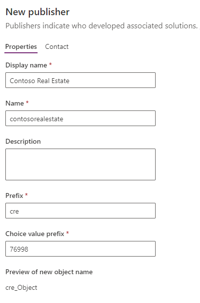
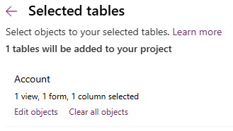

---
lab:
  title: 实验室 1：发布者和解决方案
  module: 'Module 1: Create tables in Dataverse'
---

# 实践实验室 1 - 发布者和解决方案

## 场景

在本实验室中，你将创建发布者和解决方案。

## 要学习的知识

- 如何在 Microsoft Dataverse 中创建解决方案
- 如何将现有组件添加到解决方案

## 概要实验室步骤

- 创建发布者
- 创建  解决方案
- 将表、列、视图和表单添加到解决方案
  
## 先决条件

- 必须已完成**实验室 0：验证实验室环境**

## 详细步骤

## 练习 1 - 创建发布者和解决方案

在本练习中，你将访问 Power Apps 制作者门户和开发人员环境，并创建新的解决方案。

### 任务 1.1 – 制作者门户

1. 在新选项卡中，导航到 Power Apps 制作者门户 (`https://make.powerapps.com`)；如果再次出现提示，请使用你的 Microsoft 365 凭据登录。

1. 如果系统提示你输入**电话号码**，请输入 `0123456789` 并选择“提交”****。

1. 使用屏幕右上角的环境选择器切换环境。

1. 从列表中选择“Dev One”环境****。

    

1. 从左侧导航窗格中选择“应用”，然后选择“全部”********。 你应会发现列出了多个应用，包括 Dataverse Accelerator App、Solution Health Hub、Power Pages Management 和 Package Management View。

1. 从左侧导航窗格中选择“表”****。 你应会看到“Common Data Model”中的标准表，包括“帐户”和“联系人”**。

### 任务 1.2 – 创建解决方案和发布者

1. 在左侧导航窗格中选择**解决方案**。 你应会看到多个解决方案，包括“默认解决方案”和“通用数据服务默认解决方案”****。

    

1. 选择 **+ 新建解决方案**。

1. 在“显示名称”文本框中，输入 ******`Property listings`**

1. 验证“名称”是否已自动填充****。

1. 在“发布者”下拉列表下方选择“+ 新建发布者”********。

1. 在“显示名称”中输入 `Contoso Real Estate`

1. 对于“名称”****，请输入 `contosorealestate`

1. 对于“前缀”，请输入 ****`cre`

    

1. 选择“保存”。

1. 在“发布者”下拉列表中，选择“Contoso Real Estate (contosorealestate)”********。

1. 选择**创建**。

    

## 练习 2 - 将组件添加到解决方案

在本练习中，你将向解决方案添加一个现有表。

### 任务 2.1 – 添加表

1. 导航到 Power Apps 制作者门户 (`https://make.powerapps.com`)

1. 确保你位于“Dev One”环境中。****

1. 选择**解决方案**。

1. 选择上一篇练习中所述的“Contoso Real Estate”解决方案****。

    

1. 选择“添加现有项”，然后选择“表”********。

    

1. 选择**客户**表。

    

1. 选择**下一步**。

1. 在“帐户”表下，选择“选择对象”链接********。

1. 在“列”选项卡中，选择“帐号”列********。

1. 选择**视图**选项卡。

1. 选择**活跃帐户**视图。

1. 选择**窗体**选项卡。

1. 选择“帐户”表单****。

1. 选择 **添加** 。

    > **注意：** 应该为“帐户”表选择 1 个视图、1 个表单和 1 列****。

    

1. 选择 **添加** 。
