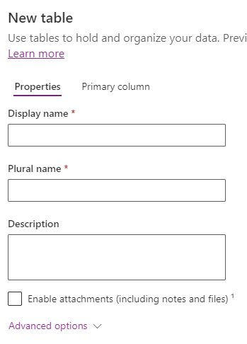
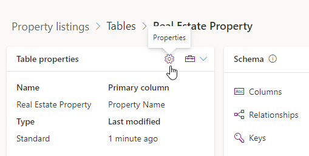
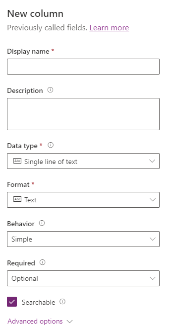
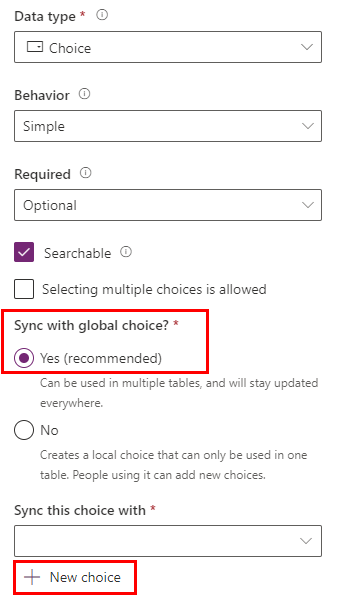
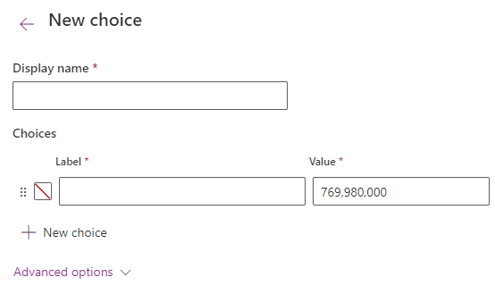

---
lab:
  title: 实验室 2：数据模型
  module: 'Module 1: Create tables in Dataverse'
---

# 实践实验室 2 – 数据模型

## 场景

在此实验室中，你将创建 Dataverse 表、列和关系。

Contoso Real Estate 希望跟踪两个关键元素：

- 房地产物业清单
- 已安排谁制作房地产物业展示资料

## 要学习的知识

- 如何在 Dataverse 中创建表
- 如何向 Dataverse 表中添加列
- 如何创建表与表之间的关系

## 概要实验室步骤

- 创建表
- 创建列
- 创建关系
  
## 先决条件

- 必须已完成“实验室 1：**** 发布者和解决方案”

## 详细步骤

## 练习 1 - 创建表

在本练习中，你将创建表并将其添加到解决方案。

### 任务 1.1 - 创建 Real Estate Property 表

1. 导航到 Power Apps 制作者门户 (`https://make.powerapps.com`)

1. 确保你位于 **Dev One** 环境中。

1. 选择**解决方案**。

1. 打开“**物业清单**”解决方案。

1. 选择“**+ 新建**”，然后选择“**表**”并选择“**表（高级属性）**”。

    

1. 在“显示名称”中输入 `Real Estate Property`。 将自动填充复数名称。

1. 选择**主列**选项卡。

1. 在“显示名称”中输入 `Property Name`。

1. 展开“高级选项”，查看可用的选项，但不在此处做任何更改。****

    

1. 选择“属性”选项卡。

1. 展开“高级选项”。

1. 选中“创建新活动”。****

1. 选中“在搜索结果中显示”。****

    

1. 选择“保存”。

### 任务 1.2 - 创建 Showing 表

1. 在“对象”窗格中，选择“所有”。********

1. 选择“**+ 新建**”，然后选择“**表**”并选择“**表（高级属性）**”。

1. 在“显示名称”中输入 `Showing`。 将自动填充复数名称。

1. 展开“高级选项”。

1. 选中“在搜索结果中显示”。****

1. 选择“保存”。

### 任务 1.3 - 创建 Open House 表

1. 在“对象”窗格中，选择“所有”。********

1. 选择“**+ 新建**”，然后选择“**表**”并再次选择“**表（高级属性）**”。

1. 在“显示名称”中输入 `Open House`。 将自动填充复数名称。

1. 展开“高级选项”。

1. 对于“记录所有权”，选择“组织”。********

1. 选择“保存”。

### 任务 1.4 – 添加 contact 表

1. 在“对象”窗格中，选择“所有”。********

1. 选择“添加现有项”，然后选择“表”********。

1. 选择**联系人**表。

1. 选择**下一步**。

1. 选择 **添加** 。

## 练习 2 - 创建列

在本练习中，你将在解决方案中创建表列。

### 任务 2.1 - 创建 Real Estate Property 的列

1. 导航到 Power Apps 制作者门户 (`https://make.powerapps.com`)

1. 确保你位于 **Dev One** 环境中。

1. 选择**解决方案**。

1. 打开“物业清单”解决方案****。

1. 选择“Real Estate Property”表。****

1. 选择“属性”。

    

1. 选中“启用附件”，然后选择“保存”。********

1. 在**架构**下面，选择**列**。

1. 选择“+ 新建列”。

    

1. 在“显示名称”中输入 `Asking Price`。

1. 在“数据类型”下拉列表中选择“货币”。********

1. 在“必需”下拉列表中，选择“业务必需”。********

1. 选择“保存”。

1. 选择“+ 新建列”。

1. 在“显示名称”中输入 `Street`。

1. 在“必需”下拉列表中，选择“业务必需”。********

1. 选择“保存”。

1. 选择“+ 新建列”。

1. 在“显示名称”中输入 `City`。

1. 在“必需”下拉列表中，选择“业务必需”。********

1. 选择“保存”。

1. 选择“+ 新建列”。

1. 在“显示名称”中输入 `Bedrooms`。

1. 在“数据类型”下拉列表中选择“选项”，然后再次选择“选项”。************

    

1. 对于“与全局选项同步？”，选择“是”。********

1. 选择“+ 新建选项”。****

    

1. 在“显示名称”中输入 `Number of Rooms`。

1. 输入 `1` 作为标签，输入 `1` 作为值。********

1. 选择“+ 新建选项”，输入 `2` 作为标签，输入 `2` 作为值。************

1. 选择“+ 新建选项”，输入 `3` 作为标签，输入 `3` 作为值。************

1. 选择“+ 新建选项”，输入 `4` 作为标签，输入 `4` 作为值。************

1. 选择“+ 新建选项”，输入 `5` 作为标签，输入 `5` 作为值。************

    

1. 选择“保存”。

1. 在“与此选项同步的项”中，选择“Number of Rooms”。********

1. 选择“保存”。

1. 选择“+ 新建列”。

1. 在“显示名称”中输入 `Bathrooms`。

1. 在“数据类型”下拉列表中选择“选项”，然后再次选择“选项”。************

1. 在“与此选项同步的项”中，选择“Number of Rooms”。********

1. 选择“保存”。

### 任务 2.2 - 创建 Showing 的列

1. 在“对象”窗格中，选择“所有”。********

1. 选择“Showing”表。****

1. 在**架构**下面，选择**列**。

1. 选择“+ 新建列”。

1. 在“显示名称”中输入 `Showing Date`。

1. 在“数据类型”下拉列表中选择“日期和时间”。********

1. 在“格式”下拉列表中选择“仅限日期”。********

1. 在“必需”下拉列表中，选择“业务必需”。********

1. 选择“保存”。

1. 选择“+ 新建列”。

1. 在“显示名称”中输入 `Comments`。

1. 在“数据类型”下拉列表中选择“文本”，然后在“多行文本”下选择“纯文本”。****************

1. 选择“保存”。

1. 选择“+ 新建列”。

1. 在“显示名称”中输入 `Level of Interest`。

1. 在“数据类型”下拉列表中选择“选项”，然后再次选择“选项”。************

1. 对于“与全局选项同步？”，选择“否”。********

1. 在“标签”中输入 `Very High` 。

1. 选择“+ 新建选项”，输入 `High` 作为标签。********

1. 选择“+ 新建选项”，输入 `Medium` 作为标签。********

1. 选择“+ 新建选项”，输入 `Low` 作为标签。********

1. 选择“+ 新建选项”，输入 `No interest` 作为标签。********

1. 选择“保存”。

1. 选择“+ 新建列”。

1. 在“显示名称”中输入 `Shown by`。

1. 在“数据类型”下拉列表中选择“查找”，然后再次选择“查找”。************

1. 在“相关表”下拉列表中，选择“User”。********

1. 选择“保存”。

### 任务 2.3 - 创建 Open House 的列

1. 在“对象”窗格中，选择“所有”。********

1. 选择“Open House”表。****

1. 在**架构**下面，选择**列**。

1. 选择“+ 新建列”。

1. 在“显示名称”中输入 `Open House Date`。

1. 在“数据类型”下拉列表中选择“日期和时间”。********

1. 在“格式”下拉列表中选择“仅限日期”。********

1. 在“必需”下拉列表中，选择“业务必需”。********

1. 选择“保存”。

## 练习 3 - 创建关系

在本练习中，你将在解决方案的表之间创建关系。

### 任务 3.1 - Real Estate Property 与 Contact 之间的关系

1. 导航到 Power Apps 制作者门户 (`https://make.powerapps.com`)

1. 确保你位于 **Dev One** 环境中。

1. 选择**解决方案**。

1. 打开“物业清单”解决方案****。

1. 选择“Real Estate Property”表。****

1. 在“架构”下，选择“关系”。********

1. 选择“+ 新建关系”，然后选择“多对一”。********

1. 在“相关(一)表”下拉列表中，选择“Contact”。********

1. 输入 `Client` 作为查找列显示名称。****

1. 在“查找列要求”下拉列表中，选择“业务必需”。********

1. 选择“完成”  。

### 任务 3.2 - Real Estate Property 与 Showing 之间的关系

1. 选择“+ 新建关系”，然后选择“一对多”。********

1. 在“相关(多)表”下拉列表中，选择“Showing”。********

1. 在“查找列要求”下拉列表中，选择“业务必需”。********

1. 选择“完成”  。

### 任务 3.3 - Real Estate Property 与 Open House 之间的关系

1. 选择“+ 新建关系”，然后选择“一对多”。********

1. 在“相关(多)表”下拉列表中，选择“Open House”。********

1. 在“查找列要求”下拉列表中，选择“业务必需”。********

1. 展开“常规”。****

1. 在“关系名称”中输入 `realestateproperty_openhouse`。

1. 选择“完成”  。

### 任务 3.4 – Showing 与 Contact 之间的关系

1. 在“对象”窗格中，选择“所有”。********

1. 选择“Showing”表。****

1. 在“架构”下，选择“关系”。********

1. 选择“+ 新建关系”，然后选择“多对一”。********

1. 在“相关(一)表”下拉列表中，选择“Contact”。********

1. 输入 `Shown to` 作为查找列显示名称。****

1. 选择“完成”  。

