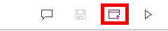

---
lab:
  title: 实验室 3：创建模型驱动应用
  module: 'Module 2: Get started with model-driven apps in Power Apps'
---

# 实践实验室 3 - 创建模型驱动的应用

## 场景

在本实验室中，你将创建模型驱动的应用并向该应用添加表。

Contoso Real Estate 希望跟踪两个关键元素：

- 房地产物业清单
- 已安排谁制作房地产物业展示资料

## 要学习的知识

- 如何创建模型驱动的应用
- 如何将表添加到应用

## 概要实验室步骤

- 创建模型驱动应用
- 将表添加到应用
  
## 先决条件

- 必须已完成“**实验室 2：数据模型**

## 详细步骤

## 练习 1 - 生成模型驱动的应用

在本练习中，你将创建模型驱动的应用。

### 任务 1.1 – 创建物业管理应用

1. 导航到 Power Apps 制作者门户 (`https://make.powerapps.com`)

1. 确保你位于 **Dev One** 环境中。

1. 选择**解决方案**。

1. 打开“物业清单”解决方案****。

1. 依次选择“+ 新建”、“应用”、“模型驱动的应用”************。

    

1. 在“名称”中输入 `Property Management` 。

1. 选择**创建**。

    

### 任务 1.2 – 添加表

1. 选择 **+ 添加页面**。

    

1. 选择“Dataverse 表”****。

1. 在“搜索”中输入 `cre`****。

    

1. 选择“开放参观日”、“房地产物业”和“展示”************。

1. 在“搜索”中输入 `account`，然后选择“帐户”********。

1. 在“搜索”中输入 `contact`，然后选择“联系人”********。

1. 选择 **添加** 。

    

1. 选择“保存”。

1. 选择**发布**。

    

### 任务 1.3 – 测试

1. 打开“物业管理”应用设计器后，选择“播放”按钮********。

1. 导航到“联系人”****。

1. 选择“+ 新建”  。

1. 在“名字”中输入 `Jon`****。

1. 在“姓氏”中输入 `Doe`****

1. 选择**保存并关闭**。

1. 导航到“房地产物业”****

1. 选择“+ 新建”  。

1. 在“物业名称”中输入 `Test Property`****。

1. 选择“保存”。

1. 选择“相关”和“展示”********。

    

1. 选择“+ 新建展示资料”****。

1. 在“名称”中输入 `First Showing` 。

1. 选择**保存并关闭**。

1. 选择**保存并关闭**。

