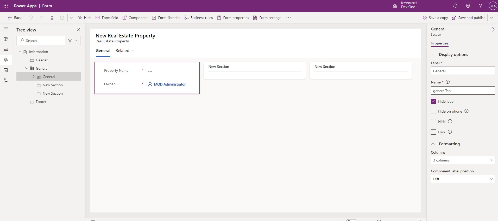
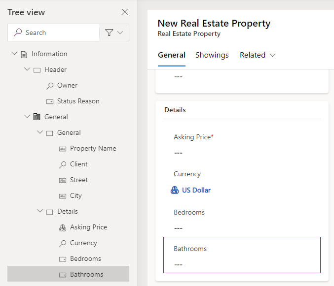
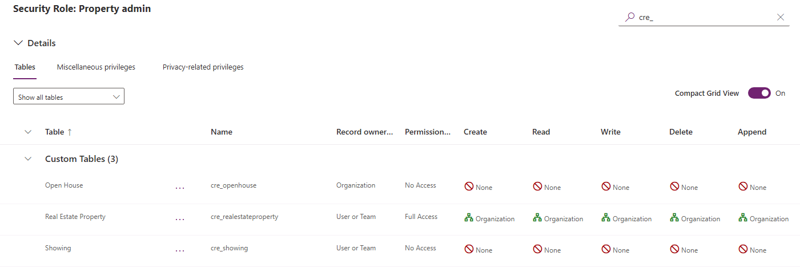

---
lab:
  title: 实验室 4：配置窗体和视图
  module: 'Module 3: Configure forms, charts, and dashboards in model-driven apps'
---

# 实践实验室 4 - 配置窗体和视图

## 场景

在此实验室中，你将为模型驱动型应用配置窗体和视图。

Contoso Real Estate 希望跟踪两个关键元素：

- 房地产物业清单
- 已安排谁制作房地产物业展示资料

## 要学习的知识

- 如何配置表窗体
- 如何配置表视图

## 概要实验室步骤

- 配置 Real Estate Property 和 Showing 的主窗体
- 配置选项卡和分区
- 向窗体中添加列
- 添加子网格
- 创建新窗体
- 将安全角色与窗体关联
- 配置 Real Estate Property 和 Showing 的视图
- 筛选器视图
- 配置“快速查找”视图
  
## 先决条件

- 必须已完成“**实验室 2：数据模型**

## 详细步骤

## 练习 1 - Real Estate Property 主窗体

在本练习中，你将修改 Real Estate Property 表的主窗体。

### 任务 1.1 – 主窗体布局和列

1. 导航到 Power Apps 制作者门户 (`https://make.powerapps.com`)

1. 确保你位于 **Dev One** 环境中。

1. 选择**解决方案**。

1. 打开“物业清单”解决方案****。

1. 选择 Real Estate Property 表。****

1. 在**数据体验**下，选择**窗体**。

1. 选择“窗体类型”为“主要”的“信息”窗体，选择“命令”菜单 (...)，然后选择“编辑” > “在新选项卡中编辑”。************************

1. 在窗体设计器的左侧选择“树状视图”。****

1. 选择**常规**选项卡。

1. 在“名称”中输入 `generalTab` 。

1. 在右侧的“属性”窗格中，在“布局”下拉列表中选择“3 列”。************

    

1. 在“树状视图”中，展开“常规”选项卡。******** 选择第一个分区，然后输入 `generalSection` 作为名称。****

1. 选择第二个分区，然后输入 `Timeline` 作为标签，输入 `timelineSection` 作为名称。********

1. 选择第三个分区，然后输入 `Related` 作为标签，输入 `relatedSection` 作为名称。********

1. 将“Owner”字段拖到“标题”区域中。********

    

1. 从窗体设计器的左侧导航栏中选择“表列”。****

1. 将“Status Reason”列拖到“标题”区域中。********

1. 选择第一个分区。

1. 将“Client”列拖到“Property Name”字段下方。********

1. 选择“Street”列以将其添加到窗体中的“Client”下方。********

1. 选择“City”列以将其添加到窗体中的“Street”下方。********

1. 从窗体设计器的左侧导航栏中选择“组件”。****

1. 选择“1 列分区”控件以将其添加到窗体的“常规”部分下方。****

1. 输入 `Details` 作为标签，输入 `detailsSection` 作为名称。********

1. 从窗体设计器的左侧导航栏中选择“表列”。****

1. 选择“Asking Price”列以将其添加到“Details”分区。****

1. 选择“Currency”列以将其添加到窗体中的“Asking Price”下方。********

1. 选择“Bedrooms”列以将其添加到窗体中的“Currency”下方。********

1. 选择“Bathrooms”列以将其添加到窗体中的“Bedrooms”下方。********

    

### 任务 1.2 – 添加时间线控件

1. 从窗体设计器的左侧导航栏中选择“树状视图”。****

1. 选择“Timeline”分区。****

1. 从窗体设计器的左侧导航栏中选择“组件”。****

1. 展示“展示”。****

1. 选择“时间线”控件以将其添加到“Timeline”分区。********

1. 从窗体设计器的左侧导航栏中选择“树状视图”，展开“常规”选项卡，然后选择“Timeline”分区。************

1. 在右侧的“属性”窗格中，选中“隐藏标签”框。********

    

1. 在“树状视图”中，选择时间线的“注释文本”控件。********

1. 在右侧的“属性”窗格中，选择“社交活动”，取消选中“启用”框，然后选择“完成”。****************

1. 在右侧的“属性”窗格中，从“活动排序依据”下拉列表中选择“创建日期”。************

### 任务 1.3 – 添加“快速视图”控件

1. 在窗体设计器的左侧选择“树状视图”。****

1. 选择“Related”分区。****

1. 从窗体设计器的左侧导航栏中选择“组件”。****

1. 展示“展示”。****

1. 选择“快速视图”控件以将其添加到“Related”分区。********

1. 对于“查找”，请选择“Client”，对于“联系方式”，请选择“account contact card”，然后选择“完成”。********************

### 任务 1.4 – 添加选项卡

1. 从窗体设计器的左侧导航栏中选择“组件”。****

1. 选择“1 列选项卡”控件以将其添加到窗体。****

1. 输入 `Showings` 作为标签，输入 `showingTab` 作为名称。********

1. 在窗体设计器的左侧选择“树状视图”，展开“Showings”选项卡，然后选择“新建分区”分区。************

1. 输入 `Showings` 作为标签，输入 `showingSection` 作为名称。********

1. 从窗体设计器的左侧导航栏中选择“组件”。****

1. 展开“网格”。****

1. 选择“子网格”控件以将其添加到“Showings”分区。********

1. 选择“显示相关记录”。****

1. 针对“**表格**”选择“**展示（房地产物业）**”，针对“**默认视图**”选择“**活动展示**”，然后选择“**完成**”。

1. 输入 `Showings` 作为标签，输入 `showingsSG` 作为名称。********

1. 选择“隐藏标签”。****

1. 选择**保存并发布**。

1. 关闭窗体设计器。****

1. 选择“完成”  。

## 练习 2 - Showing 主窗体

在本练习中，你将修改“Showing”表的主窗体。

### 任务 2.1 – 主窗体布局和列

1. 导航到 Power Apps 制作者门户 (`https://make.powerapps.com`)

1. 确保你位于 **Dev One** 环境中。

1. 选择**解决方案**。

1. 打开“物业清单”解决方案****。

1. 选择“Showing”表。****

1. 在**数据体验**下，选择**窗体**。

1. 选择“窗体类型”为“主要”的“信息”窗体，选择“命令”菜单 (...)，然后选择“编辑” > “在新选项卡中编辑”。************************

1. 将“Owner”字段拖到“标题”区域中。********

1. 从窗体设计器的左侧导航栏中选择“表列”。****

1. 将“Real Estate Property”列拖到“Name”字段下方。********

1. 选择“Shown to”列以将其添加到窗体中的“Real Estate Property”下方。********

1. 选择“Shown by”列以将其添加到窗体中的“Shown to”下方。********

1. 选择“Showing Date”列以将其添加到窗体中的“Shown by”下方。********

1. 选择“感兴趣程度”列以将其添加到窗体的“展示日期”下方。********

1. 选择“Comments”列以将其添加到窗体中的“Level of Interest”下方。********

1. 在右侧的“属性”窗格中，将“窗体字段高度”增加到“3 行”。************

1. 选择**保存并发布**。

1. 关闭窗体设计器。****

1. 选择“完成”  。

## 练习 3 - 多个窗体

在本练习中，你将创建一个新窗体，并使用安全角色限制访问。

### 任务 3.1 – 安全角色

1. 导航到 Power Apps 制作者门户 (`https://make.powerapps.com`)

1. 确保你位于 **Dev One** 环境中。

1. 选择**解决方案**。

1. 打开“物业清单”解决方案****。

1. 依次选择“+ 新建”、“安全性”和“安全角色”。************

1. 输入 `Property admin` 作为角色名称。****

1. 选择“根业务部门”，然后选择“保存”。********

1. 在页面右上角的“按表名称搜索”中输入 `cre_`。****

1. 在页面左侧的下拉列表中选择“显示所有表”****。

1. 选择“Real Estate Property”表。****

1. 选择“命令”菜单 (...)，然后选择“权限设置”。********

1. 选择“完全访问权限”以将所有权限的访问级别更改为“组织”。********

1. 选择“保存”。

    

1. 选择“Showing”表。****

1. 选择“命令”菜单 (...)，然后选择“权限设置”。********

1. 选择“完全访问权限”以将所有权限的访问级别更改为“组织”。********

1. 选择“保存”。

1. 选择“Open House”表。****

1. 选择“命令”菜单 (...)，然后选择“权限设置”。********

1. 选择“完全访问权限”以将所有权限的访问级别更改为“组织”。********

1. 选择“保存”。

1. 选择“<- 返回”****。

### 任务 3.2 – 复制窗体

1. 选择“Showing”表。****

1. 在**数据体验**下，选择**窗体**。

1. 选择“窗体类型”为“主要”的“信息”窗体，选择“命令”菜单 (...)，然后选择“编辑” > “在新选项卡中编辑”。************************

1. 选择“感兴趣程度”，然后在“属性”窗格中选择“只读”。********

1. 选择“备注”，然后在“属性”窗格中选择“只读”。********

1. 选择“保存副本”。

1. 输入 `Showing admin form` 作为显示名称，然后选择“保存”。********

    

1. 选择**窗体设置**。

1. 选择“Property admin”安全角色。****

    

1. 选择**保存并发布**。

1. 关闭窗体设计器。****

1. 选择“完成”  。

## 练习 4 - Real Estate Property 的视图

在本练习中，你将修改 Real Estate Property 表的视图。

### 任务 4.1 - Real Estate Property 公共视图

1. 导航到 Power Apps 制作者门户 (`https://make.powerapps.com`)

1. 确保你位于 **Dev One** 环境中。

1. 选择**解决方案**。

1. 打开“物业清单”解决方案****。

1. 选择 Real Estate Property 表。****

1. 在**数据体验**下，选择**视图**。

1. 选择“Active Real Estate Properties”视图，选择“命令”菜单 (...)，然后选择“编辑” > “在新选项卡中编辑”。****************

1. 选择“Created On”列旁边的插入号，然后选择“移除”。********

1. 选择“Asking Price”列以将其添加到视图。****

1. 选择“City”列以将其添加到视图。****

1. 选择“Bedrooms”列以将其添加到视图。****

1. 选择“Bathrooms”列以将其添加到视图。****

1. 选择“Client”列以将其添加到视图。****

1. 在“属性”窗格中，移除“排序依据”下的“Property Name”。********

1. 在“属性”窗格中，选择“排序依据”，然后选择“Asking Price”。********

    

1. 选择**保存并发布**。

1. **关闭**视图设计器。

1. 选择“完成”  。

### 任务 4.2 – Real Estate Property“快速查找”视图

1. 选择“**Quick Find Active Real Estate Properties**”视图，选择“**命令**”菜单 (...)，然后选择“**编辑**” > “**在新选项卡中编辑**”。

1. 选择“Created On”列旁边的插入号，然后选择“移除”。********

1. 在右侧的“**Quick Find Active Real Estate Properties**”窗格中，在“**查找依据**”下选择“**编辑查找表列**”。

1. 选择以下列，然后选择“应用”。****

    - City
    - 客户端
    - 属性名称

1. 选择**保存并发布**。

1. **关闭**视图设计器。

1. 选择“完成”  。

## 练习 5 - Showing 的视图

在本练习中，你将修改“Showing”表的视图。

### 任务 5.1 – Showing 公共视图

1. 导航到 Power Apps 制作者门户 (`https://make.powerapps.com`)

1. 确保你位于 **Dev One** 环境中。

1. 选择**解决方案**。

1. 打开“物业清单”解决方案****。

1. 选择“Showing”表。****

1. 在**数据体验**下，选择**视图**。

1. 选择“Active Showings”视图，选择“命令”菜单 (...)，然后选择“编辑” > “在新选项卡中编辑”。****************

1. 选择“Created On”列旁边的插入号，然后选择“移除”。********

1. 选择“Real Estate Property”列以将其添加到视图。****

1. 选择“Showing Date”列以将其添加到视图。****

1. 选择“Shown to”列以将其添加到视图。****

1. 选择“Level of Interest”列以将其添加到视图。****

1. 选择“Related”选项卡。****

1. 展开“Real Estate Property”。****

1. 选择“Asking Price”列以将其添加到视图。****

1. 在“属性”窗格中，移除“排序依据”下的“Name”。********

1. 在“属性”窗格中，选择“排序依据”，然后选择“Showing Date”。********

1. 在“保存和发布”下拉菜单中，选择“仅保存”。********

### 任务 5.2 – 新建 Showing 的视图

1. 选择“另存为”。

1. 在“名称”中输入 `High Interest showings` 。

1. 选择“保存”。

1. 选择“Level of Interest”列旁边的插入号，然后选择“筛选依据”。********

1. 选择“等于”，然后选择“Very High”和“High”。************

1. 选择“应用”。

1. 选择**保存并发布**。

1. **关闭**视图设计器。

1. 选择“完成”  。
