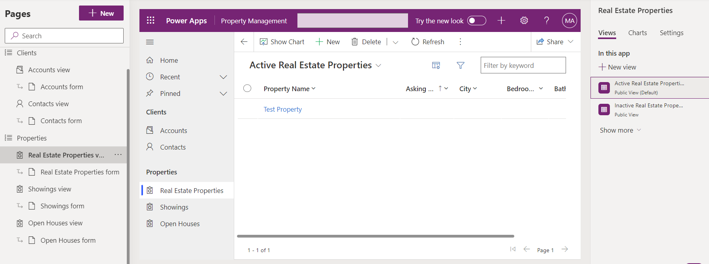

---
lab:
  title: 实验室 5：配置模型驱动应用
  module: 'Module 3: Configure forms, charts, and dashboards in model-driven apps'
---

# 练习实验室 5 - 配置模型驱动型应用

## 场景

在此实验室中，你将配置模型驱动型应用。

## 要学习的知识

- 如何为模型驱动型应用配置导航
- 如何限制模型驱动型应用中的视图

## 概要实验室步骤

- 将组添加到导航
- 在导航中移动表
- 在应用中限制视图
  
## 先决条件

- 必须已完成“**实验室 2：数据模型**，**实验室 3：创建模型驱动应用**，**实验室 4：配置窗体和视图**

## 详细步骤

## 练习 1 - 配置模型驱动型应用

在本练习中，你将配置模型驱动型应用的导航和表。

### 任务 1.1 - 配置组

1. 导航到 Power Apps Maker 门户 <https://make.powerapps.com>。

1. 确保你位于 **Dev One** 环境中。

1. 选择**解决方案**。

1. 打开“**物业清单**”解决方案。

1. 在左侧的“**对象**”窗格中，选择“**应用**”。

1. 依次选择“**属性管理**”应用、“**命令**”菜单 (...)、“**编辑** > ”“**在新选项卡中编辑**”。

1. 在“**导航**”窗格中选择“**新建组**”。

    

1. 在属性窗格中，输入`Clients`作为**标题**。

1. 依次选择“**导航**”、“**命令**”菜单 (...)、“**新建组**”。

1. 在属性窗格中，输入`Properties`作为**标题**。

1. 在“**导航窗格**”中，依次选择“**看房视图**”、“**命令**”菜单 (...)、“**下移**”。

1. 在“**导航窗格**”中，依次选择“**房地产属性视图**”、“**命令**”菜单 (...)、“**下移**”。

1. 在“**导航窗格**”中，依次选择“**看房时间视图**”、“**命令**”菜单 (...)、“**下移**”（三次）。

    

### 任务 1.2 – 限制视图

1. 在“**导航**”窗格中，选择“**看房视图**”。

1. 在“**看房**”窗格中，选择“**视图**”选项卡。

1. 在右侧窗格中选择“**非活动看房视图**”，依次选择“**命令**”菜单 (...)、“**删除**”。

    

1. 选择“保存”。

1. 选择**发布**。

1. **关闭**应用设计器，然后选择“**完成**”。

