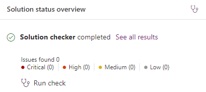

---
lab:
  title: 实验室 6：导出解决方案
  module: 'Module 4: Manage solutions in Power Apps and Power Automate'
---

# 练习实验室 6 - 导出解决方案

## 场景

在此实验室中，你将导出解决方案

## 要学习的知识

- 如何导出 Microsoft Dataverse 解决方案

## 概要实验室步骤

- 发布自定义项
- 运行解决方案检查器
- 导出解决方案
  
## 先决条件

- 必须已完成“**实验室 5：配置模型驱动型应用**

## 详细步骤

## 练习 1 - 导出解决方案

在本练习中，你将从开发环境中导出解决方案。

### 任务 1.1 - 发布更改

1. 导航到 Power Apps 制作者门户 (`https://make.powerapps.com`)

1. 确保你位于 **Dev One** 环境中。

1. 选择**解决方案**。

1. 选择“**物业清单**”属性列表。

1. 在解决方案中，选择“**概述**”选项卡。

    

1. 选择**发布所有自定义**。

### 任务 1.2 – 解决方案检查器

1. 在解决方案中，选择“**概述**”选项卡。

1. 在“**解决方案状态概述**”下选择“**运行检查**”。

1. 等待几分钟，让解决方案检查器完成。

    

1. 不应看到任何警告或错误。

### 任务 1.3 - 导出托管解决方案

1. 选择“导出”。

1. 选择**下一步**。

1. 再次选择**下一步**。

1. 版本号应已递增到**1.0.0.1**。

    

1. 为“**导出为**”选择“**托管**”。

1. 选择“导出”。

1. 将在后台准备导出。 解决方案准备就绪后，选择“**下载**”按钮。

### 任务 1.4 – 导出非托管解决方案

1. 选择“导出”。

1. 选择**下一步**。

1. 再次选择**下一步**。

1. 版本号应已递增到**1.0.0.2**。

1. 将版本号更改为`1.0.0.1`

1. 为“**导出为**”选择“**非托管**”。

1. 选择“导出”。

1. 将在后台准备导出。 解决方案准备就绪后，选择“**下载**”按钮。
